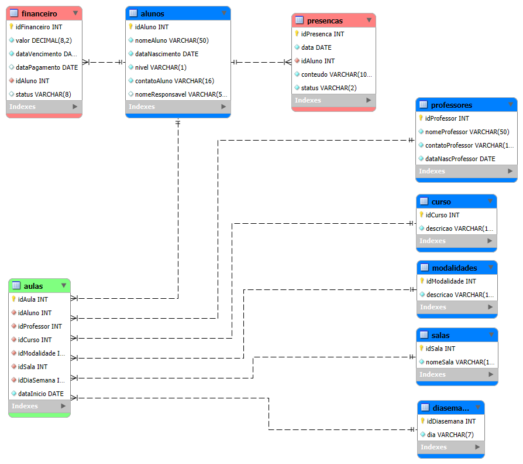

# SiGEM – Sistema de Gestão para Escola de Música

## Descrição do Sistema

O SiGEM tem como objetivo gerenciar as atividades de uma escola de música, permitindo o cadastro e controle de alunos, professores, modalidades de ensino e salas. O sistema organiza informações acadêmicas e administrativas, proporcionando maior controle sobre aulas, frequência e financeiro.

---

## Regras de Negócio

### Alunos
- O sistema deve permitir o cadastro de alunos com informações pessoais.
- Cada aluno possui um nível de aprendizado:
  - Iniciante
  - Intermediário
  - Avançado
- Alunos podem estar matriculados em um ou mais cursos.

---

### Professores
- O sistema deve permitir o cadastro de professores.
- Professores podem estar vinculados a um ou mais cursos.

---

### Modalidades
- As modalidades definem o tipo de aula oferecida.
- Cada modalidade pode ser:
  - Individual
  - Em grupo

---

### Salas
- O sistema deve permitir o cadastro de salas.
- Uma sala pode ser utilizada por diferentes cursos em horários distintos.

---

### Cursos
- Cada curso deve estar vinculado a:
  - Um professor
  - Uma modalidade
  - Uma sala
- Cada curso deve possuir uma data de início.
- Um curso pode ter vários alunos matriculados.

---

### Matrícula
- Um aluno pode se matricular em um ou mais cursos.
- Cada matrícula deve registrar:
  - Valor da mensalidade
  - Dia da semana da aula

---

### Aulas
- O sistema deve registrar as aulas realizadas em cada curso.
- Cada aula deve conter:
  - Data
  - Conteúdo ministrado

---

### Presença
- A presença deve ser registrada para cada aluno em cada aula.
- O status da presença pode ser:
  - Presente
  - Falta
  - Reposição

---

### Financeiro
- O sistema deve controlar os pagamentos dos alunos.
- Cada registro deve conter:
  - Valor
  - Data de vencimento
  - Data de pagamento
  - Status (pago, pendente ou atrasado)

---

### Integridade dos Dados
- Não é permitido:
  - Registrar presença de aluno não matriculado no curso
  - Registrar aula para curso inexistente
- O sistema deve manter histórico de:
  - Aulas
  - Matrículas
  - Frequência dos alunos

---

## Diagrama do Banco de Dados

---

## Autor
Dilber Gonçalves
